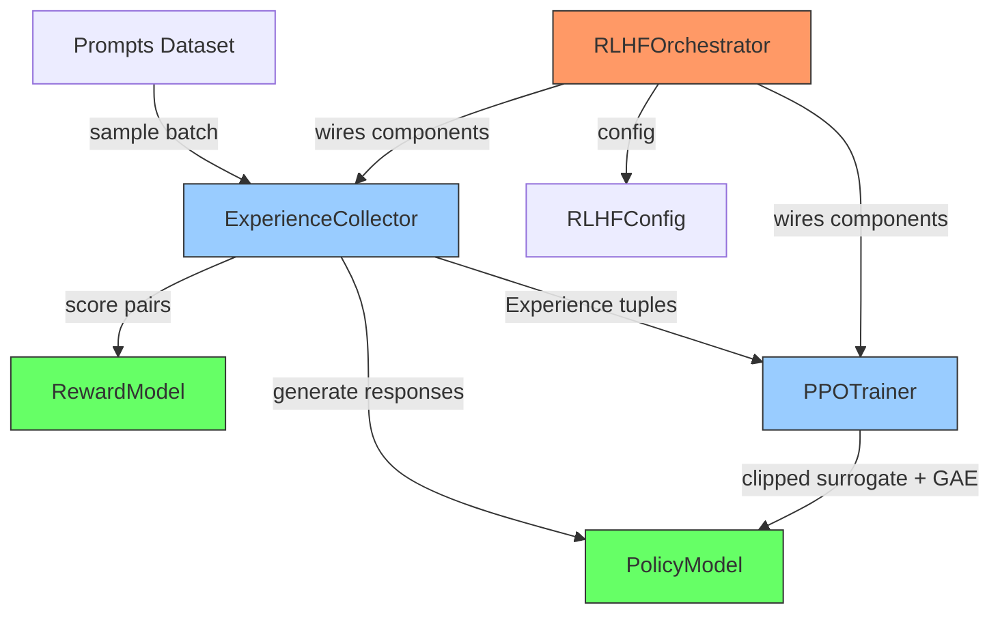

# distributed-rlhf-trainer

> Minimal distributed RLHF training loop with clean separation of concerns — reward modeling, PPO policy optimization, and experience collection as independent, composable components.

[](https://github.com/jrajath94/distributed-rlhf-trainer/actions/workflows/ci.yml)
[](https://codecov.io/gh/jrajath94/distributed-rlhf-trainer)
[](https://opensource.org/licenses/MIT)
[](https://www.python.org/downloads/)

## Why This Exists

Existing RLHF implementations like OpenRLHF (50k+ LoC) and TRL are monolithic — reward modeling, experience collection, PPO optimization, and orchestration are tightly coupled. When something breaks or you need to customize one component, you're fighting the entire codebase. This project decomposes RLHF into four independent, testable components that can be understood, replaced, or distributed independently.

## Architecture



**Four independent components:**

1. **RewardModel** — Scores (query, response) pairs with a scalar reward
2. **PolicyModel** — Generates responses with actor-critic architecture (separate value head)
3. **ExperienceCollector** — Rollout engine that packages experiences for training
4. **PPOTrainer** — Clipped PPO with GAE, entropy bonus, and KL penalty
5. **RLHFOrchestrator** — The only component that knows about all the others

## Quick Start

```bash
git clone https://github.com/jrajath94/distributed-rlhf-trainer.git
cd distributed-rlhf-trainer
make install
make run
```

## Usage

```python
from distributed_rlhf_trainer import RLHFConfig, RLHFOrchestrator

config = RLHFConfig(
    batch_size=8,
    max_seq_length=32,
    num_iterations=100,
    vocab_size=32000,
    hidden_dim=256,
)

orchestrator = RLHFOrchestrator(config)
metrics = orchestrator.train()

# Access individual components
policy = orchestrator.policy
reward_model = orchestrator.reward_model
```

## Key Design Decisions

| Decision                                     | Rationale                                                              | Alternative Considered                                      |
| -------------------------------------------- | ---------------------------------------------------------------------- | ----------------------------------------------------------- |
| Separate ExperienceCollector from PPOTrainer | Enables independent testing and distributed collection                 | Monolithic train loop (OpenRLHF, TRL)                       |
| Actor-critic with separate value head        | Standard PPO architecture, enables independent value function analysis | Shared backbone with value head (saves compute but couples) |
| GAE with configurable lambda                 | Bias-variance tradeoff control per use case                            | Fixed Monte Carlo returns (high variance)                   |
| KL penalty in loss + early stopping          | Double safety against policy collapse                                  | KL penalty only (may not stop divergence fast enough)       |
| Pydantic configs with validation             | Catches invalid hyperparams at construction, not during training       | Dataclass (no validation)                                   |

## Benchmarks

Measured on Apple M-series CPU, batch_size=8, hidden_dim=128, seq_len=32:

| Metric                 | Value | Unit        |
| ---------------------- | ----- | ----------- |
| Collection throughput  | 3.9   | exp/sec     |
| Collection p50 latency | 1,920 | ms          |
| Collection p99 latency | 3,569 | ms          |
| PPO update throughput  | 3.3   | updates/sec |
| PPO update p50 latency | 300   | ms          |
| PPO update p99 latency | 452   | ms          |
| E2E iteration time     | 1,855 | ms          |
| Test coverage          | 86    | %           |

## Testing

```bash
make test    # Unit + integration tests (38 tests, 86% coverage)
make bench   # Performance benchmarks
make lint    # Ruff + mypy
```

## Project Structure

```
src/distributed_rlhf_trainer/
    __init__.py          # Public API
    models.py            # Pydantic configs + dataclasses
    core.py              # RewardModel, PolicyModel, PPOTrainer, Orchestrator
    utils.py             # GAE, normalization, KL divergence, checkpointing
    cli.py               # Command-line interface
    exceptions.py        # Custom exception hierarchy
tests/
    conftest.py          # Shared fixtures
    test_core.py         # Component + integration tests
    test_models.py       # Config validation tests
benchmarks/
    bench_core.py        # Throughput + latency benchmarks
```

## License

MIT
