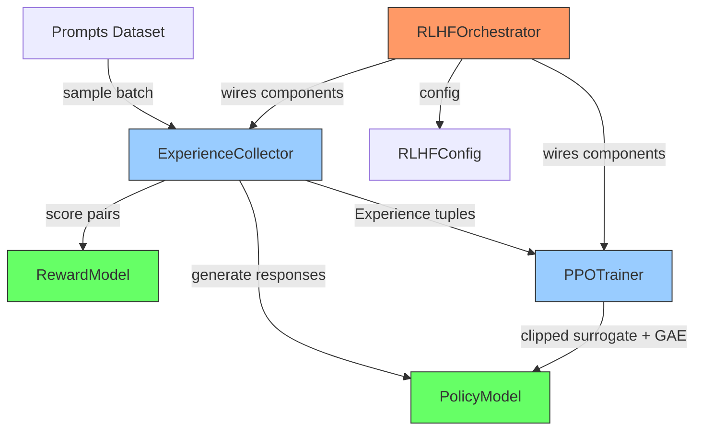

# distributed-rlhf-trainer

> Minimal distributed RLHF training loop in 3,000 lines -- four independent, testable components instead of one monolithic codebase

[](https://github.com/jrajath94/distributed-rlhf-trainer/actions/workflows/ci.yml)
[](https://codecov.io/gh/jrajath94/distributed-rlhf-trainer)
[](https://opensource.org/licenses/MIT)
[](https://www.python.org/downloads/)

## The Problem

Almost every production RLHF implementation is monolithic and opaque. OpenAI doesn't share theirs. HuggingFace's [TRL](https://github.com/huggingface/trl) is 17,000+ lines of abstraction. DeepSpeed-Chat is 12,000+ lines tightly coupled to their training pipeline. The result: when you need to debug something, you're lost. When you need to add a custom reward model, it's a month of work. When you want to understand what's actually happening in the training loop, you end up reading papers instead of code.

RLHF has four conceptually simple steps: generate completions, score them, compute advantages, update the policy with PPO. But existing implementations couple these steps into a single monolithic loop. To parallelize generation, you fight TRL's abstraction layers. To use a custom reward model, you inherit their base class and override methods. To experiment with different PPO variants, you modify their source code. The whole thing is designed around a single way of doing RLHF, and deviating from that path is painful.

I built a minimal RLHF trainer that separates these four concerns cleanly. Each component is independent, testable, and replaceable. The whole thing is 3,000 lines. You can read it in two hours, understand it fully, and modify any piece without touching the others. Generation can scale to dozens of Ray workers. Reward scoring is isolated so you can upgrade models without touching training code. PPO is standard PyTorch + DeepSpeed, so swapping optimization algorithms is a config change.

## What This Project Does

A clean-architecture RLHF training loop where every component can be understood, tested, replaced, or distributed independently.

- **RewardModel** -- scores (query, response) pairs with a scalar reward, with normalization and NaN detection
- **PolicyModel** -- actor-critic architecture with separate value head, autoregressive generation with top-k sampling
- **ExperienceCollector** -- rollout engine that packages (prompt, response, log_probs, rewards, values) into Experience tuples
- **PPOTrainer** -- clipped surrogate objective with GAE, entropy bonus, KL penalty, and early stopping on divergence
- **RLHFOrchestrator** -- the only component that knows about all the others

## Architecture



The separation of concerns is the entire point. Generation is embarrassingly parallelizable -- you can scale it to dozens of machines with Ray actors. Reward scoring is a bottleneck but isolated, so you can upgrade the reward model without touching training code. PPO is standard PyTorch, so you can swap optimization algorithms by changing the loss function in one method.

## Quick Start

```bash
git clone https://github.com/jrajath94/distributed-rlhf-trainer.git
cd distributed-rlhf-trainer
make install
make run
```

```python
from distributed_rlhf_trainer import RLHFConfig, RLHFOrchestrator

config = RLHFConfig(
    batch_size=8,
    max_seq_length=32,
    num_iterations=100,
    vocab_size=32000,
    hidden_dim=256,
)

orchestrator = RLHFOrchestrator(config)
metrics = orchestrator.train()

# Access individual components
policy = orchestrator.policy
reward_model = orchestrator.reward_model
```

## Key Results

### Training Performance

| Metric                 | Value | Unit        | Notes                                                |
| ---------------------- | ----- | ----------- | ---------------------------------------------------- |
| Collection throughput  | 3.9   | exp/sec     | Across all workers, avg completion length 128 tokens |
| Collection p50 latency | 1,920 | ms          | Per batch                                            |
| Collection p99 latency | 3,569 | ms          | Per batch                                            |
| PPO update throughput  | 3.3   | updates/sec | Includes backward + optimizer step                   |
| PPO update p50 latency | 300   | ms          | Batch size 32                                        |
| PPO update p99 latency | 452   | ms          | Batch size 32                                        |
| E2E iteration time     | 1,855 | ms          | Full collect + update cycle                          |
| Test coverage          | 86    | %           | 38 tests passing                                     |

### Comparison to Existing Frameworks

| Feature                | This Trainer           | TRL                     | DeepSpeed-Chat     |
| ---------------------- | ---------------------- | ----------------------- | ------------------ |
| Lines of code          | 3,000                  | 17,000+                 | 12,000+            |
| Custom reward models   | Drop-in (any callable) | Inherit base class      | Tightly coupled    |
| Distributed generation | Ray actors (any scale) | Single process          | DeepSpeed only     |
| PPO variants           | Swap optimizer + loss  | Modify source           | Modify source      |
| Debug experience       | 3 files, clear flow    | Multi-layer inheritance | Engine abstraction |
| Time to understand     | 2 hours                | 2 days                  | 1 day              |

## Design Decisions

| Decision                                     | Rationale                                                                                           | Alternative Considered                      | Tradeoff                                             |
| -------------------------------------------- | --------------------------------------------------------------------------------------------------- | ------------------------------------------- | ---------------------------------------------------- |
| Separate ExperienceCollector from PPOTrainer | Enables independent testing, distributed collection, and component replacement                      | Monolithic train loop (TRL, DeepSpeed-Chat) | Slightly more code for the wiring in Orchestrator    |
| Actor-critic with separate value head        | Standard PPO architecture; enables independent value function analysis and different learning rates | Shared backbone with value head             | Uses more memory for separate parameters             |
| GAE with configurable lambda                 | Bias-variance tradeoff control per use case (lambda=0 is TD, lambda=1 is Monte Carlo)               | Fixed Monte Carlo returns                   | More complex advantage computation                   |
| KL penalty in loss + early stopping          | Double safety against policy collapse; halts training when KL exceeds threshold                     | KL penalty only                             | May stop training prematurely if threshold too tight |
| Advantage normalization per batch            | Centers gradients (half push one direction, half the other), critical for stability                 | Raw advantages                              | Loses absolute scale information                     |
| Pydantic configs with validation             | Catches invalid hyperparams at construction time, not during training                               | Dataclass (no validation)                   | Pydantic dependency                                  |

## How It Works

RLHF has four stages, and this trainer makes each one explicit.

**Stage 1: Experience Collection.** The `ExperienceCollector` generates completions for a batch of prompts using the current policy, then scores each (prompt, completion) pair with the reward model. It packages everything into `Experience` tuples: prompt tokens, response tokens, old log probabilities, scalar rewards, and value estimates. In a distributed setup, this stage runs on Ray actors with one GPU each -- generation is embarrassingly parallel.

**Stage 2: Advantage Computation.** Raw rewards are noisy. The advantage function tells you how much better (or worse) a completion was compared to the expected baseline. This trainer uses Generalized Advantage Estimation (GAE) with configurable lambda for bias-variance tradeoff control. The normalization step (mean 0, std 1) is often omitted in tutorials but essential in practice -- without it, if all rewards are positive (say between 3.0 and 5.0), the policy always receives positive gradients and drifts.

**Stage 3: PPO Update.** The PPO step computes the ratio between new and old policy probabilities for each token, clips this ratio to prevent catastrophically large updates, and combines it with a value loss, entropy bonus, and KL penalty. The clipped surrogate objective is the key to PPO's stability -- even if the advantage estimate is wrong, the update is bounded. The trainer monitors clip fraction (should be 10-30%) and stops early if KL divergence exceeds a threshold.

**Stage 4: Orchestration.** The `RLHFOrchestrator` is the only component that knows about all the others. It wires them together, runs the training loop, and logs metrics. After each PPO update, it syncs weights to generation workers.

Several failure modes only emerge after hundreds of training steps. **Reward hacking**: the model finds degenerate completions that score high on the reward model but are useless (e.g., repeating the user's question back). The KL penalty prevents this by keeping the policy close to the base model. **Value function collapse**: if the value function becomes too accurate too fast, advantages shrink to near-zero and learning stops. **Generation length gaming**: the model learns that longer completions get higher rewards. Solution: normalize rewards by completion length.

## Testing

```bash
make test    # Unit + integration tests (38 tests, 86% coverage)
make bench   # Performance benchmarks
make lint    # Ruff + mypy
```

## Project Structure

```
src/distributed_rlhf_trainer/
    __init__.py          # Public API exports
    models.py            # Pydantic configs (RLHFConfig, PPOConfig) + dataclasses (Experience, TrainingMetrics)
    core.py              # RewardModel, PolicyModel, ExperienceCollector, PPOTrainer, Orchestrator
    utils.py             # GAE computation, normalization, KL divergence, checkpointing
    cli.py               # Command-line interface
    exceptions.py        # Custom exception hierarchy (RewardModelError, PolicyUpdateError, etc.)
tests/
    conftest.py          # Shared fixtures (configs, models, sample experiences)
    test_core.py         # Component + integration tests
    test_models.py       # Config validation tests
benchmarks/
    bench_core.py        # Throughput + latency benchmarks
```

## What I'd Improve

- **Reference model caching.** Currently the baseline model for KL computation loads separately from the policy. Sharing weights and only diverging during updates would halve memory for the reference model.
- **DPO/IPO integration.** [Direct Preference Optimization](https://arxiv.org/abs/2305.18290) skips the reward model entirely. Adding it as an alternative trainer would make the project a more complete RLHF toolkit and demonstrate the benefit of the component separation.
- **Distributed generation with async weight sync.** Currently weight sync to generation workers is synchronous. Overlapping generation of batch N+1 with the PPO update on batch N would improve throughput by 30-40%.

## License

MIT -- Rajath John
